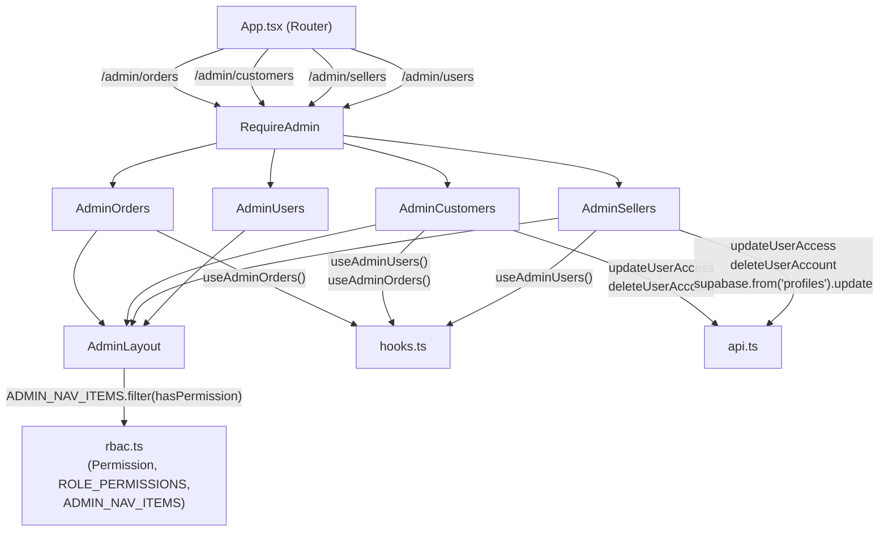

# Design Document — Admin Pages Expansion

## Overview

This feature expands the LibraVault admin dashboard from two pages (Dashboard, Users) to five pages
by wiring up the dormant `AdminOrders.tsx` and adding two new page components (`AdminCustomers.tsx`,
`AdminSellers.tsx`). All three pages integrate with the existing `AdminLayout` shell, are gated by
`RequireAdmin`, and follow the RBAC permission model already established in `rbac.ts`.

The scope touches four layers:

1. **`rbac.ts`** — new permissions, new nav items, updated permission array.
2. **`App.tsx`** — new routes registered, old redirect removed.
3. **`AdminOrders.tsx`** — unchanged; just needs its route to stop redirecting.
4. **New components** — `AdminCustomers.tsx` and `AdminSellers.tsx`, both self-wrapping in
   `AdminLayout` and following the patterns established in `AdminUsers.tsx` and `AdminOrders.tsx`.

No new Supabase schema changes are required. The `admin_update_user_access`, `admin_delete_user`,
and `get_all_profiles` RPCs already exist and already handle the operations needed.

---

## Architecture



The dashboard is a pure client-side SPA: all data fetching happens via Supabase JS in the browser.
`RequireAdmin` runs before any admin component mounts, redirecting unauthenticated users to `/login`
and non-admin roles to `/access-denied`.

---

## Components and Interfaces

### rbac.ts changes

**Permission union** — two new string literals added:

```typescript
export type Permission =
  | 'admin:access'
  | 'products:read' | 'products:create' | 'products:update' | 'products:delete'
  | 'orders:read' | 'orders:update_status' | 'orders:delete'
  | 'users:read' | 'users:update_role' | 'users:update_status' | 'users:delete'
  | 'analytics:read'
  | 'customers:read'   // NEW
  | 'sellers:manage'   // NEW
```

**ROLE_PERMISSIONS** — admin array updated:

```typescript
admin: [
  'admin:access',
  'orders:read', 'orders:update_status',          // newly granted
  'customers:read',                               // NEW
  'sellers:manage',                               // NEW
  'users:read', 'users:update_role', 'users:update_status', 'users:delete',
],
```

**ADMIN_NAV_ITEMS** — five items in display order:

```typescript
import { LayoutDashboard, ShoppingBag, UserCheck, Store, Users } from 'lucide-react'

export const ADMIN_NAV_ITEMS: AdminNavItem[] = [
  { to: '/admin',           label: 'Dashboard', icon: LayoutDashboard, permission: 'admin:access'   },
  { to: '/admin/orders',    label: 'Orders',    icon: ShoppingBag,     permission: 'orders:read'    },
  { to: '/admin/customers', label: 'Customers', icon: UserCheck,       permission: 'customers:read' },
  { to: '/admin/sellers',   label: 'Sellers',   icon: Store,           permission: 'sellers:manage' },
  { to: '/admin/users',     label: 'Users',     icon: Users,           permission: 'users:read'     },
]
```

### App.tsx changes

Remove the `/admin/orders` redirect; add three new routes:

```tsx
// REMOVE:
<Route path="/admin/orders" element={<Navigate to="/admin/users" replace />} />

// ADD:
import AdminOrders    from './pages/admin/AdminOrders'
import AdminCustomers from './pages/admin/AdminCustomers'
import AdminSellers   from './pages/admin/AdminSellers'

<Route path="/admin/orders"    element={<RequireAdmin><AdminOrders /></RequireAdmin>} />
<Route path="/admin/customers" element={<RequireAdmin><AdminCustomers /></RequireAdmin>} />
<Route path="/admin/sellers"   element={<RequireAdmin><AdminSellers /></RequireAdmin>} />
```

### AdminCustomers.tsx

Self-contained page component following the `AdminUsers` pattern exactly.

```
Props: none
Hooks: useAdminUsers(), useAdminOrders()
State: search (string), saving (string|null), error (string)
```

Client-side data derivation:
- `customers` = `users.filter(u => u.role === 'customer')`
- `filtered` = customers after applying `search` filter (name or email, case-insensitive)
- `orderCountByUserId` = `Map<string, number>` computed from `useAdminOrders()` data by grouping
  on the order's `profiles.id` (the `useAdminOrders` hook does not expose user_id directly, but
  each order row has an `email` field; the mapping is by matching email or by fetching with
  `user_id` — see Data Models section for the solution).

Key UI elements:
- Section header with total customer count and suspended count
- Dismissible error banner (same markup as `AdminUsers`)
- Search input (`admin-search` class)
- `admin-card` wrapping an `admin-table`
- Columns: User (avatar + name + email), Account Status badge, Orders (count), Joined, Actions
- Actions: Suspend / Reactivate, Delete
- Loading: `<Loader>` spinner with `@keyframes spin`
- Empty states: "No customers match your search." / "No customers found."

`runAction` helper (copied verbatim pattern from `AdminUsers`):
```typescript
const runAction = async (userId: string, action: () => Promise<void>) => {
  setError('')
  setSaving(userId)
  try { await action(); await refetch() }
  catch (err: unknown) { setError(err instanceof Error ? err.message : 'Action failed.') }
  finally { setSaving(null) }
}
```

### AdminSellers.tsx

Self-contained page component. More complex than Customers due to the Edit modal and debounced search.

```
Props: none
Hooks: useAdminUsers()
State:
  search (string)             — raw input value
  debouncedSearch (string)    — delayed 300ms via useEffect + setTimeout
  saving (string|null)
  error (string)
  editSeller (SellerProfile | null)   — controls modal open/closed
  editForm (EditForm)                  — controlled form state
```

`EditForm` shape:
```typescript
interface EditForm {
  full_name: string
  email: string
  seller_status: 'pending' | 'approved' | 'rejected'
  account_status: 'active' | 'suspended'
}
```

Debounce pattern (no external library):
```typescript
useEffect(() => {
  const t = setTimeout(() => setDebouncedSearch(search), 300)
  return () => clearTimeout(t)
}, [search])
```

Edit modal save logic — two sequential calls:
```typescript
// 1. Update statuses via RPC
await updateUserAccess(editSeller.id, {
  seller_status: editForm.seller_status,
  account_status: editForm.account_status,
})
// 2. Update profile fields directly
await supabase.from('profiles').update({
  full_name: editForm.full_name,
  email: editForm.email,
}).eq('id', editSeller.id)
```

Key UI elements:
- Section header with total seller count, pending count, suspended count
- Dismissible error banner
- Search input + debounce
- `admin-card` with `admin-table`
- Columns: Seller (avatar + name + email), Seller Status badge, Account Status badge, Joined, Actions
- Actions: Approve / Reject / Edit / Suspend / Reactivate / Delete
- Edit modal: full-screen overlay with controlled form (full_name, email, seller_status select,
  account_status select), Save and Cancel buttons
- Loading, empty states (two variants)
- No "Add Seller" button

---

## Data Models

### Profile record shape (from `get_all_profiles` RPC)

```typescript
interface Profile {
  id: string
  full_name: string | null
  email: string | null
  role: 'admin' | 'seller' | 'customer'
  account_status: 'active' | 'suspended'
  seller_status: 'pending' | 'approved' | 'rejected' | null
  created_at: string
}
```

### Order count mapping (AdminCustomers)

`useAdminOrders()` returns rows with an `email` field (the customer's email). To compute order counts
per customer, build a frequency map keyed on email:

```typescript
const orderCountByEmail = useMemo(() => {
  const map = new Map<string, number>()
  for (const order of orders ?? []) {
    map.set(order.email, (map.get(order.email) ?? 0) + 1)
  }
  return map
}, [orders])
```

Each customer row then reads `orderCountByEmail.get(u.email) ?? 0`. This avoids a second network
call and is consistent with the data already returned by the existing hook.

### Badge color constants

Defined locally in each component (matching `AdminUsers.tsx` constants):

```typescript
// Seller status
const SELLER_STATUS_META = {
  pending:  { label: 'Pending',  color: '#d97706', bg: '#fef3c7' },
  approved: { label: 'Approved', color: '#16a34a', bg: '#dcfce7' },
  rejected: { label: 'Rejected', color: '#dc2626', bg: '#fee2e2' },
}

// Account status
const ACCOUNT_STATUS_META = {
  active:    { label: 'Active',    color: '#16a34a', bg: '#dcfce7' },
  suspended: { label: 'Suspended', color: '#dc2626', bg: '#fee2e2' },
}
```

---

## Correctness Properties

*A property is a characteristic or behavior that should hold true across all valid executions of a
system — essentially, a formal statement about what the system should do. Properties serve as the
bridge between human-readable specifications and machine-verifiable correctness guarantees.*

---

### Property 1: RBAC permission table correctness

*For any* role and any permission string, `hasPermission(role, permission)` SHALL return `true` if
and only if that permission appears in `ROLE_PERMISSIONS[role]`. Specifically:
- `hasPermission('admin', p)` returns `true` for `orders:read`, `orders:update_status`,
  `customers:read`, and `sellers:manage`.
- `hasPermission('seller', p)` and `hasPermission('customer', p)` return `false` for all four
  of the above permissions.
- `hasPermission(null, p)` returns `false` for any permission.

**Validates: Requirements 1.2, 1.6, 2.1, 3.1, 4.2, 4.3, 4.4**

---

### Property 2: Nav visibility follows hasPermission

*For any* role, the set of nav items rendered by `AdminLayout` (i.e., `ADMIN_NAV_ITEMS.filter(item => hasPermission(role, item.permission))`) SHALL contain exactly those items for which `hasPermission(role, item.permission)` is `true`, and no others. No item should appear in the visible list for a role that lacks its required permission.

**Validates: Requirements 1.4, 4.5**

---

### Property 3: Role-based profile filtering

*For any* array of profile records with arbitrary `role` values, filtering by `role === 'customer'`
shall return exactly those records whose role is `'customer'` (and no records with any other role),
and filtering by `role === 'seller'` shall return exactly those records whose role is `'seller'`.
The filter must be total: no profile that matches shall be excluded, and no profile that does not
match shall be included.

**Validates: Requirements 2.4, 3.4**

---

### Property 4: Case-insensitive search filter

*For any* array of profile records and any non-empty search query string `q`, the filtered result
shall contain exactly those profiles where `full_name.toLowerCase().includes(q.toLowerCase())` OR
`email.toLowerCase().includes(q.toLowerCase())` is `true`. Profiles that match neither field must
be excluded. Profiles that match either field must be included. The filter must be symmetric with
respect to case: searching "smith" must yield the same set as searching "SMITH" or "Smith".

**Validates: Requirements 2.7, 3.6**

---

### Property 5: Order count aggregation per customer

*For any* list of order rows and any customer email address, the computed order count for that
customer SHALL equal the exact number of order rows in the list whose `email` field matches that
customer's email. Customers with no matching orders shall have a count of exactly `0`.

**Validates: Requirements 2.6**

---

### Property 6: Edit modal pre-population

*For any* seller profile record, when the admin opens the Edit modal for that seller, the initial
form state SHALL be pre-populated with that seller's exact `full_name` (or `''` if null), `email`
(or `''` if null), `seller_status`, and `account_status` values — no field shall default to a
value other than what the profile record contains.

**Validates: Requirements 3.9**

---

### Property 7: Badge color and label mapping

*For any* valid `seller_status` value (`'pending'`, `'approved'`, `'rejected'`) or `account_status`
value (`'active'`, `'suspended'`), the badge metadata lookup SHALL return the exact color and label
defined in the respective constant (`SELLER_STATUS_META` or `ACCOUNT_STATUS_META`). No valid status
value should produce a color or label different from the specified mapping.

**Validates: Requirements 3.17**

---

### Property 8: Nav items order invariant

*For any* execution of the application, the positions of nav items in `ADMIN_NAV_ITEMS` SHALL
satisfy the strict ordering: the index of `'/admin'` < index of `'/admin/orders'` < index of
`'/admin/customers'` < index of `'/admin/sellers'` < index of `'/admin/users'`. This ordering must
hold regardless of which items are ultimately rendered for a given role.

**Validates: Requirements 5.1**

---

## Error Handling

All data mutations in `AdminCustomers` and `AdminSellers` use the `runAction` helper pattern from
`AdminUsers`. This provides consistent error handling across all admin pages:

| Scenario | Behavior |
|---|---|
| API call succeeds | `refetch()` called; UI updates to new data |
| API call throws | Error message extracted; shown in inline dismissible banner |
| User dismisses error | Banner hidden; UI state unchanged |
| Loading in progress | Action buttons show a spinner; all action buttons for that row are disabled (`disabled={saving === userId}`) |
| Edit modal — save fails | Modal stays open; error banner shown above the table (not inside modal) |
| Delete — user cancels confirm() | No API call made |

The `supabase.from('profiles').update()` call in `AdminSellers.tsx` is called after
`updateUserAccess` succeeds. If the profile update fails, the error is caught by the wrapping
`runAction`-equivalent handler, the modal closes (consistent with the described behavior for
modal errors surfacing outside the modal), and the error banner is shown.

Edge cases:
- `full_name` null/undefined — displayed as `"(no name)"` in the table; form pre-populates
  with empty string `''`.
- `email` null/undefined — displayed as empty string; form pre-populates with `''`.
- Order count for customer with no orders — defaults to `0` via `map.get(email) ?? 0`.
- `seller_status` null on a seller profile (shouldn't occur but possible) — treat as `'pending'`
  for badge rendering purposes.

---

## Testing Strategy

### Test framework

No test framework is currently installed in this project. Given the React + TypeScript + Vite stack,
the standard choice is **Vitest** (same config surface as Vite) with **@testing-library/react** for
component tests.

For property-based testing, **fast-check** is the standard library for TypeScript projects.

Install commands (dev dependencies only):
```bash
npm install --save-dev vitest @testing-library/react @testing-library/user-event jsdom fast-check
```

### Dual testing approach

**Unit / example tests** cover specific behaviors, wiring checks, and edge cases:
- `hasPermission` returns correct values for the new permissions (examples)
- `ADMIN_NAV_ITEMS` contains the correct entries in the correct order
- Routes render the correct components (not redirects)
- `runAction` calls refetch on success and sets error on failure
- Loading spinner renders while data is loading
- Empty state messages render correctly
- Edit modal saves correctly and closes on success

**Property-based tests** (fast-check, minimum 100 iterations each) cover universal behaviors:

Each PBT is tagged with a comment in the format:
`// Feature: admin-pages-expansion, Property N: <property_text>`

**Test implementation for Property 1 — RBAC permission table correctness:**
```typescript
// Feature: admin-pages-expansion, Property 1: hasPermission returns true iff permission is in ROLE_PERMISSIONS[role]
fc.assert(fc.property(
  fc.constantFrom('admin', 'seller', 'customer'),
  fc.constantFrom(...allPermissions),
  (role, permission) => {
    const expected = ROLE_PERMISSIONS[role].includes(permission)
    return hasPermission(role, permission) === expected
  }
), { numRuns: 100 })
```

**Test implementation for Property 2 — Nav visibility follows hasPermission:**
```typescript
// Feature: admin-pages-expansion, Property 2: visibleNav contains item iff hasPermission(role, item.permission)
fc.assert(fc.property(
  fc.constantFrom('admin', 'seller', 'customer', null),
  (role) => {
    const visible = ADMIN_NAV_ITEMS.filter(item => hasPermission(role, item.permission))
    return ADMIN_NAV_ITEMS.every(item => {
      const shouldBeVisible = hasPermission(role, item.permission)
      const isVisible = visible.includes(item)
      return shouldBeVisible === isVisible
    })
  }
), { numRuns: 100 })
```

**Test implementation for Property 3 — Role-based profile filtering:**
```typescript
// Feature: admin-pages-expansion, Property 3: role filter returns exactly matching profiles
fc.assert(fc.property(
  fc.array(fc.record({ id: fc.uuid(), role: fc.constantFrom('admin', 'seller', 'customer') })),
  fc.constantFrom('customer', 'seller'),
  (profiles, targetRole) => {
    const filtered = profiles.filter(p => p.role === targetRole)
    return filtered.every(p => p.role === targetRole) &&
      profiles.filter(p => p.role === targetRole).length === filtered.length
  }
), { numRuns: 100 })
```

**Test implementation for Property 4 — Case-insensitive search filter:**
```typescript
// Feature: admin-pages-expansion, Property 4: search filter is case-insensitive and exact
fc.assert(fc.property(
  fc.array(fc.record({ full_name: fc.option(fc.string()), email: fc.option(fc.string()) })),
  fc.string({ minLength: 1 }),
  (profiles, query) => {
    const q = query.toLowerCase()
    const filtered = profiles.filter(p =>
      p.full_name?.toLowerCase().includes(q) || p.email?.toLowerCase().includes(q)
    )
    return filtered.every(p =>
      p.full_name?.toLowerCase().includes(q) || p.email?.toLowerCase().includes(q)
    )
  }
), { numRuns: 100 })
```

**Test implementation for Property 5 — Order count aggregation per customer:**
```typescript
// Feature: admin-pages-expansion, Property 5: order count equals matching order rows by email
fc.assert(fc.property(
  fc.array(fc.record({ email: fc.emailAddress() })),
  fc.emailAddress(),
  (orders, email) => {
    const map = new Map<string, number>()
    for (const order of orders) map.set(order.email, (map.get(order.email) ?? 0) + 1)
    const expected = orders.filter(o => o.email === email).length
    return (map.get(email) ?? 0) === expected
  }
), { numRuns: 100 })
```

**Test implementation for Property 6 — Edit modal pre-population:**
```typescript
// Feature: admin-pages-expansion, Property 6: edit form pre-populated with seller's exact field values
fc.assert(fc.property(
  fc.record({
    full_name: fc.option(fc.string()),
    email: fc.option(fc.string()),
    seller_status: fc.constantFrom('pending', 'approved', 'rejected'),
    account_status: fc.constantFrom('active', 'suspended'),
  }),
  (seller) => {
    const form = buildInitialEditForm(seller)  // the function extracted from component
    return form.full_name === (seller.full_name ?? '') &&
      form.email === (seller.email ?? '') &&
      form.seller_status === seller.seller_status &&
      form.account_status === seller.account_status
  }
), { numRuns: 100 })
```

**Test implementation for Property 7 — Badge color and label mapping:**
```typescript
// Feature: admin-pages-expansion, Property 7: badge metadata is correct for all valid status values
fc.assert(fc.property(
  fc.constantFrom('pending', 'approved', 'rejected'),
  (status) => {
    const meta = SELLER_STATUS_META[status]
    return meta.color === expectedSellerColors[status] &&
      meta.label === expectedSellerLabels[status]
  }
), { numRuns: 100 })

fc.assert(fc.property(
  fc.constantFrom('active', 'suspended'),
  (status) => {
    const meta = ACCOUNT_STATUS_META[status]
    return meta.color === expectedAccountColors[status]
  }
), { numRuns: 100 })
```

**Test implementation for Property 8 — Nav items order invariant:**
```typescript
// Feature: admin-pages-expansion, Property 8: nav items appear in the required order
const paths = ADMIN_NAV_ITEMS.map(i => i.to)
const orderedPaths = ['/admin', '/admin/orders', '/admin/customers', '/admin/sellers', '/admin/users']
// No randomness needed — this is a structural invariant checked once
orderedPaths.reduce((prevIdx, path) => {
  const idx = paths.indexOf(path)
  expect(idx).toBeGreaterThan(prevIdx)
  return idx
}, -1)
```

### Test file locations

```
src/
  __tests__/
    rbac.test.ts           — Properties 1, 2, 7, 8 (pure functions)
    profileFilter.test.ts  — Properties 3, 4 (filter logic extracted to helpers)
    orderCount.test.ts     — Property 5 (aggregation logic extracted to helper)
    sellerEditForm.test.ts — Property 6 (form init logic extracted to helper)
    routes.test.tsx        — Example tests for route wiring
    adminCustomers.test.tsx — Component example tests
    adminSellers.test.tsx   — Component example tests
```

> **Note on extracting testable logic:** To make Properties 3–6 independently testable without
> rendering full components, the filter, aggregation, and form-init logic should be extracted into
> small pure functions in a `src/lib/adminHelpers.ts` module that the components import. This is
> standard practice for making component logic independently unit-testable.
